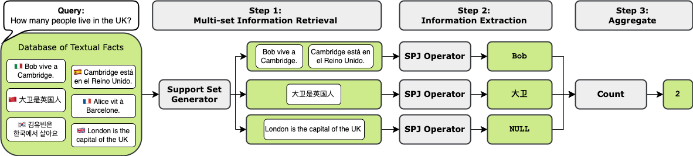

# Cross-Lingual Neural Databases

<strong> 🚧 REPOSITORY UNDER CONSTRUCTION 🚧 </strong>




Recently proposed Neural Databases (NDBs) allow users to interact with unstructured textual facts with natural language queries and without the rigid attributes, relationships, and complex queries of classical SQL databases.
Previous studies on NDBs focus on English corpora and queries, and currently, there is no evidence about the performance of NDBs in a cross-lingual setting. 
In this paper, we explore the capabilities and limitations of NDBs when both facts and queries are written in different languages. 
To this aim, we machine-translate and release a cross-lingual version of WikiNLDB, where each database comprises facts and associated queries in up to six languages.
We thus investigate NDBs' ability to generalize across multiple languages by analyzing the impact of using multilingual pre-trained language models on the main NDB metrics.
In particular, we compare multiple languages in both zero-shot and supervised settings.
Our experiments show that cross-lingual supervision is an essential aspect of NDBs training. 
Experimental results indeed show that the F1 score increases from 34.94\% in a zero-shot setting to 84.47\% after cross-lingual supervised training.

## Cite our work!
Coming soon
```bibtex

```


## Translate Dataset

X-WikiNLDB FQ
```bash
python3 google_translate_batch.py --exp_name cross-lingual-FQ --translate_query --list_file_to_translate train.jsonl dev.jsonl test.jsonl
```

Monolingual baselines
```bash
python3 google_translate_batch.py --exp_name monolingual-FQ-French --translate_query --list_file_to_translate test.jsonl --language_list FR
python3 google_translate_batch.py --exp_name monolingual-FQ-Italian --translate_query --list_file_to_translate test.jsonl --language_list IT
...
```

You can find the whole procedure by executing the file build_dataset.sh

